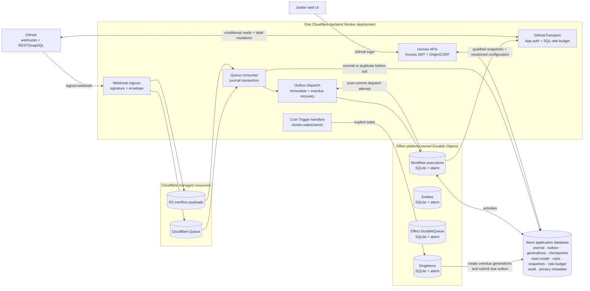

# GitHub synchronization design

## Status

Proposed companion to [GitHub auto-labeling design](./auto-labeling-design.md). No implementation is included.

This design assumes Janitor can connect from Cloudflare Workers and Durable Objects to Neon with the selected Effect SQL driver. The Effect Cloudflare integration is available only on branch `eff-988-alchemy-cloudflare-cluster` at commit `f414380`. It is unreleased, and the Alchemy integration has typecheck and manual canary coverage but no automated live deployment coverage. Production work pins the Effect branch commit and compatible Alchemy version until a release replaces that pin.

## Decision

Deploy two Cloudflare Workers on one hostname. A website Worker holds the custom domain and serves the Foldkit app as static assets; it runs no code of ours. The backend Worker takes `/api/v1/*` off that hostname with a zone route, which is more specific than a custom domain and therefore wins. One origin, so no CORS, and the Access cookie covers both. The Access application protects the hostname rather than a Worker destination, so the edge decides before routing and both Workers are covered.

The backend Worker owns these logical boundaries in one deployment:

- signed GitHub webhook ingress;
- Cloudflare Queue production and consumption;
- R2 overflow payload access;
- Cloudflare Access-protected human APIs;
- Effect workflow registration and submission;
- GitHub and application-database activities;
- Cron Trigger handlers that wake repair singletons.

`AlchemyCloudflareCluster.make` registers four Durable Object classes, bindings, exports, and SQLite migrations for entities, workflow executions, durable queues, and singletons. It also returns the cluster context used by Worker handlers. One Effect entity, workflow execution, durable queue, or singleton maps to one SQLite-backed Durable Object.

There is no separate execution host, internal journal HTTP request, peer network, cluster port, shard transfer, or external Effect message store. Cloudflare may evict Worker and Durable Object isolates. Durable Object SQLite, alarms, and later contact reactivate durable work.

Neon remains the conservative shared application database. It owns the webhook journal, read model, outbox, coalescing generations, checkpoints, rules, snapshots, shared rate budget, audit, and privacy metadata. Effect owns Durable Object SQLite. Janitor never queries, migrates, backs up, or treats that SQLite as application storage.

GitHub remains authoritative. Webhooks provide low-latency observations, qualified local snapshots serve normal reads, and scheduled repair detects missed or unsupported events.

## Architecture

Cloudflare Queue and Effect `DurableQueue` are different systems. Cloudflare Queue is the webhook ingestion boundary. Effect `DurableQueue` is an optional workflow primitive backed by its own Durable Object. It does not replace the journal, SQL coalescing, or the workflow outbox.

## Authentication and authorization

Janitor is an internal application. Cloudflare Access authenticates people through the organization's GitHub identity provider. Janitor does not run another GitHub OAuth flow, store human GitHub tokens, or issue an application login session.

Use separate Access applications or audiences for configuration and operator routes. The normal policy admits only the GitHub team trusted as Janitor-wide configuration administrators. A stricter team policy protects operator routes.

The Worker validates every `Cf-Access-Jwt-Assertion` signature, issuer, audience, expiry, and non-empty subject. Audit identity is issuer plus subject. Email and GitHub login are display attributes, not authorization keys. JWT verification trusts one configured Access team domain, selects its keys by `kid`, caches them for a bounded interval, and refreshes once when a known issuer presents an unknown `kid`.

Access decides who may enter a human role boundary. Janitor also verifies that each requested repository belongs to an active App installation and that the operation is enabled. GitHub API calls always use App or installation credentials.

State-changing browser requests validate Origin and a CSRF token bound to the Access subject and API audience. Normal sessions last at most eight hours and operator sessions at most one hour. The runbook includes immediate Access session revocation for urgent team removal. The GitHub webhook route bypasses Access and verifies the GitHub signature over the raw body.

Local development has no edge. Under `alchemy dev` the Worker's bind phase reads `ALCHEMY_DEV`, which only that command sets, and declares a simulated Access context with the audience `local-dev` together with an env binding carrying the same value. The middleware admits a request without an assertion only when that binding is set and the request's Access context carries exactly that audience. A deploy leaves the binding empty, so the path is unreachable there; a supplied assertion is always verified regardless. Local identities are attributed to the issuer `local-dev`. The Access applications are declared only on a deploy: there is no edge locally, and the dev stage must not own the production webhook bypass.

The Queue consumer and journal repository run in the same Worker deployment. They need no internal authentication hop or second delivery signature.

## Goals

- Avoid GitHub reads for routine UI and rule evaluation.
- Collapse webhook bursts into the smallest useful set of GitHub reads.
- Mirror the installation, repository, label, entity, pull request, and label-assignment data Janitor needs.
- Expose freshness and incompleteness instead of presenting stale data as current.
- Recover from missed webhooks, pagination movement, isolate eviction, rate limits, application-database outages, and access loss.
- Use stable GitHub identities across renames, transfers, and delete/recreate cases.
- Express durable orchestration through Effect Workflow on Cloudflare Durable Objects.

## Non-goals

- A complete GitHub data warehouse.
- A transactionally consistent GitHub snapshot.
- Rebuilding GitHub state only from webhook history.
- Mirroring comments, reviews, commits, checks, or files before a rule or UI needs them.
- Exactly-once GitHub reads, writes, AI calls, or application-database activities.
- Treating one `404` or absent scan result as proof of deletion.

## Existing constraints

Janitor has installation and repository domain models, signed webhook ingress, and a Cloudflare Queue producer. It has no queue consumer, application database, GitHub API client, or workflow runtime. The current ingress acknowledges queue failure at `apps/webhooks/src/GitHub/Http.ts:118-128`; synchronization must return non-2xx when the first durable handoff fails.

The current queue stores decoded task-specific events. Replace it with a versioned generic envelope so unknown but signature-valid actions remain available for projection or repair.

## Scope of the local mirror

The first release stores:

- active App installations and their accessible repositories;
- complete label catalogs for enabled repositories;
- all open issues and pull requests in enabled repositories;
- closed or merged entities observed by webhooks, retained for audit, or selected by a rules-revision scan;
- fields used by active rule predicates;
- current label assignments for mirrored entities.

Routine bootstrap and repair do not scan all closed history. A revision that can change closed entities creates an explicit `state=all` preparation scan. Label retirement uses a complete, fully paginated `state=all` scan filtered to the retiring stable label ID. Partial, blocked, failed, or superseded retirement scans cannot release ownership. A rule depending on a new GitHub field cannot become active until its projection track is ready.

## Read model and privacy

Stable GitHub database IDs and node IDs are identities. Owner, repository name, account handle, issue number, label name, and URLs are mutable attributes.

| Record               | Identity and relevant state                                                                                 |
| -------------------- | ----------------------------------------------------------------------------------------------------------- |
| Installation         | Installation ID, account, permissions, selection, active or suspended state, bootstrap status               |
| Repository           | Repository database and node IDs, installation ID, mutable owner/name, visibility, access and enabled state |
| Label                | Repository ID, label node and database IDs, mutable display fields, availability state                      |
| Entity               | Canonical issue-side IDs, repository ID, number, kind, state, title, body, author, GitHub update time       |
| Pull request details | Entity ID, pull-request IDs, base branch, draft state, head SHA, merged state                               |
| Entity label         | Entity node ID and label node ID                                                                            |
| Webhook delivery     | Delivery ID, event/action, receipt sequence, payload reference/digest, projection status                    |
| Sync target and run  | Stable scope, generations, covered journal sequence, debounce, health, outcome                              |
| Scan checkpoint      | Run, track, exact request key, next link/cursor, ordinal, watermark, epoch                                  |
| HTTP cache entry     | Authorization scope, exact request key, ETag, decoded page reference, observed time                         |
| Rate budget          | Credential and resource bucket, limits, cooldown, fenced leases                                             |
| Workflow outbox      | Workflow tag, execution key, payload, due and acceptance state                                              |

Issue-side IDs are canonical for pull request entities. Pull-request IDs live in a required one-to-one details record. Responses join by repository ID and number before binding both identity pairs.

Rows needed by rules or audit are tombstoned. A same-name replacement with a new stable ID does not repair an old reference. GitHub numeric IDs must arrive as safe integers or losslessly decoded decimal strings.

Private repository content is encrypted at rest. Uninstall or confirmed access loss schedules deletion of raw payloads, cached pages, title/body copies, derived content, and backups according to policy. Janitor may retain non-content identifiers, hashes, and required operational audit. Logs exclude credentials and private content.

## Freshness contract

Every read has one status:

| Status    | Meaning                                                                                                                |
| --------- | ---------------------------------------------------------------------------------------------------------------------- |
| Projected | A complete known webhook updated the projection, but GitHub has not verified the latest invalidation                   |
| Verified  | An authorized API `200` or `304` covers all known invalidations through a journal sequence                             |
| Syncing   | A newer generation is pending or executing                                                                             |
| Stale     | The required verification age or repair objective expired                                                              |
| Blocked   | Suspension, access loss, missing permission, unresolved identity, or repeated schema failure prevents a qualified read |

Freshness is purpose-specific. Configuration may display projected or stale labels with age and health. Saving a ruleset requires a verified label identity or targeted validation. Evaluation may reuse a verified snapshot only while no newer invalidation exists and its age remains valid. A mutation requires a verified snapshot covering the latest known invalidation, and its activity rechecks generation and active rules revision.

If qualification fails, the caller gets refresh-required or blocked and starts or joins a targeted synchronization generation. This is bounded freshness, not linearizability. Idempotent set mutations, resulting webhooks, and repair provide convergence.

## Webhook ingestion

Ingress reads the raw body through a bounded stream, counts actual bytes independently of `Content-Length`, updates the signature digest incrementally, and stops before buffering more than GitHub's documented limit. After the complete bounded body passes signature verification, ingress creates a versioned envelope with delivery ID, event name, receipt time, digest, payload or R2 reference, and schema version. Bodies are encrypted before entering Queue, R2, Neon, or their backups. For overflow payloads, the R2 write must commit before Queue submits its reference. Ingress returns `202` only after both writes succeed; retention cleanup removes an R2 object orphaned by Queue failure.

Cloudflare Queue is the first durable acceptance boundary. Its consumer loads any R2 body and runs one application-database transaction that inserts or finds the delivery, stores the journal payload, and records pending projection. It acknowledges the Queue message only after a committed or duplicate result. A lost response retries the message; delivery ID uniqueness makes the transaction idempotent. The consumer deletes an R2 object only after journal success. Lifecycle cleanup removes orphans.

GitHub does not deliver payloads above its documented 25 MB cap. Repair covers those missing events. Raw private payload retention is bounded and encrypted. R2 expiry must exceed Cloudflare Queue retention, the maximum retry and dead-letter replay window, and a safety margin; infrastructure validation rejects an invalid lifecycle relation. Delivery metadata and normalized projections may have longer retention.

Malformed envelopes and terminal schema failures go to a dedicated Cloudflare Queue dead-letter queue with bounded, content-safe diagnostics. Replay passes through the same envelope, digest, decryption, journal, and projection validation as first delivery. Poison messages never bypass the journal or block unrelated valid messages indefinitely.

The journal transaction writes an outbox request for `ProjectGitHubWebhookV1`, keyed by delivery ID. The workflow receives the journal ID, not raw repository content. Projection applies complete declared fields, rejects older update timestamps, writes explicit tombstones only for unambiguous events, and advances affected synchronization generations in one transaction. Unknown actions remain journaled and dirty the narrowest known scope.

Delivery ID deduplicates ingestion and projection only. Receipt order is an operational sequence, not GitHub event order.

## Coalescing and outbox dispatch

SQL owns coalescing because Effect `DurableQueue` deduplicates equal item IDs but does not replace an older payload with a newer generation or close the lost-wakeup race.

Each scope has one target row. Invalidation increments `requestedGeneration`, records the highest journal sequence, moves a bounded debounce deadline, and creates an outbox row only when no dispatch covers that generation. Completion uses a generation compare-and-set, so work that arrives during a run causes one follow-up generation.

Outbox submission is idempotent. Every producer path attempts dispatch after its transaction commits: request and Queue handlers invoke the dispatcher directly, while workflow activities return committed outbox receipts to a following dispatch activity. A Cron-triggered singleton calls the same due-row dispatcher and recovers overdue rows. There is no resident poller and no process-startup assumption. Application-database work claims due rows with bounded leases and fencing so duplicate Worker invocations cannot lose work.

Effect workflow execution IDs are versioned generation keys. The Cloudflare workflow engine uses first-payload-wins for duplicate execution IDs. Therefore every duplicate submission must carry byte-for-byte equivalent logical input; changing input requires a new execution ID and usually a new workflow tag.

## Effect workflow model

Use versioned finite workflows:

| Workflow                    | Execution key                                                                                     |
| --------------------------- | ------------------------------------------------------------------------------------------------- |
| Project webhook             | Version and delivery ID                                                                           |
| Sync installation inventory | Version, installation ID, generation                                                              |
| Sync repository track       | Version, repository ID, track, generation                                                         |
| Refresh entity              | Version, repository ID, entity identity, generation                                               |
| Reconcile entity            | Version, entity identity, snapshot generation, active rules revision, AI approval-policy revision |

Breaking payload, activity-result, or orchestration changes introduce a new `Workflow.make` tag. Deployments retain old registrations until their executions finish.

Workflow bodies orchestrate serializable results. SQL, GitHub, AI, token, and audit operations stay in stable activities. Each application-database write uses workflow execution ID, activity name, and logical record identity as an idempotency key. Mutable progress and page bodies live in Neon, not workflow history.

Activities against GitHub and Neon are at-least-once. An external commit may succeed before the Durable Object persists the activity result. Retried reads and upserts must be safe. GitHub mutations refetch or verify current state and treat an already-present or already-absent desired result as success after authorization errors are excluded. AI calls can also repeat; only a persisted decision is authoritative.

Every projection path uses a per-entity write fence comparing GitHub `updated_at`, request-start invalidation sequence, and projection version. Pagination activities use deterministic unique names per logical page. Every wait, including short waits, uses a uniquely named `DurableClock`; Cloudflare stores all such clocks in workflow Durable Object SQLite and uses an alarm.

Expected failures are typed workflow results, not defects. With Effect's default defect capture, a defect is a terminal stored failure: resubmitting the same execution ID returns that result. Overdue and operator repair therefore inspect terminal outcomes and create an explicitly keyed remediation execution with a new attempt ordinal after the underlying defect is fixed. If defect capture is deliberately disabled, later contact may replay the incomplete execution, but that is not the default recovery contract. Janitor does not depend on parent-child wake RPC for durable handoff; SQL outbox and generation state remain the recovery authority.

## Synchronization tracks

Installation inventory traverses App installations and repairs missed deletion, suspension, permission, and account changes. Repository inventory traverses `GET /installation/repositories?per_page=100`. First absence becomes suspect; targeted lookup or a later complete generation confirms access loss. Inventory absence never proves deletion.

Label catalog scans store stable IDs and mutable display fields. A missing label becomes suspect after a complete scan. Explicit deletion or later stable-ID confirmation may mark it unavailable. A same-name label is never substituted.

Entity scans use the issues listing for summaries and labels and a separate pull-request track for required details. Incremental scans use `state=all`, updated-descending order, a committed watermark, overlap, and a run-start cutoff. They commit the cutoff only after all pages. Moving page boundaries can still create gaps, so stable-order full repair provides anti-entropy. Incremental omission has no deletion meaning.

Targeted entity refresh is the foreground path for webhook invalidation, preview, ruleset validation, and auto-labeling. Concurrent requests join one pending generation.

Bootstrap starts durable journaling first, records its sequence and start time, inventories the installation and repositories, completes required tracks, applies later invalidations, runs an overlapping incremental scan, and marks tracks ready independently. One failing repository does not invalidate prior complete generations for others.

## Pagination, cache, and absence safety

REST scans follow opaque `Link` relations until no next link exists. GraphQL cursors remain opaque and tied to one query shape. A complete epoch records authorization scope, exact endpoint and parameters, each committed page, ETag and decoded membership, end observation, generation, and completion.

An authorized `304` validates only the exact representation. A first-page `304` never proves later pages unchanged. Complete scans revalidate every known page and probe beyond a formerly full final page.

Partial, failed, limited, blocked, or superseded scans publish no freshness or absence transition. Repository or label absence becomes suspect. Incremental entity omission means nothing. An ambiguous `404` preserves state and requests access verification. Tombstones remain reversible.

Cache keys include GitHub host and API version, App or installation authorization scope, method, full URL and query, page or cursor, and media type. Conditional requests retain pacing because secondary limits may still apply.

## Shared rate budget

All GitHub reads and writes use one server-only `GitHubTransport`. `GitHubBudget` stores shared limits, cooldowns, rolling secondary-limit estimates, and bounded fenced leases in Neon. A Worker-local limiter is insufficient across concurrently active Durable Objects.

Every response records limit, remaining, used, reset, resource, GitHub request ID, `Retry-After`, and shared secondary cooldown. Mutation verification and webhook refresh have highest priority, followed by access repair and label validation, incremental synchronization, then bootstrap and full repair. Background work preserves a foreground reserve. All active objects honor the same persisted cooldown.

## Repair scheduling

Cloudflare Cron Triggers explicitly invoke `cluster.wake(name)`. The named singleton creates repair generations and dispatches overdue outbox rows; it does not call GitHub directly. Duplicate wakes coalesce while one wake runs. Each invocation compares the last successful planning time with policy and creates at most one overdue recovery generation.

Initial policy includes installation and repository inventory every few hours, daily label repair, overlapping entity repair every few hours, weekly full open-entity repair, targeted managed-label retirement scans, failed-delivery audit within GitHub's redelivery window, and early repair after bootstrap or access recovery. Schedules are staggered by installation.

## Auto-labeling handoff

This document owns snapshot qualification and execution infrastructure. The auto-labeling design owns rule and managed-label semantics.

A ruleset save writes a revision-scoped preparation request in the same application transaction. The repository stores configured and active revisions separately. Synchronization prepares required projection tracks and promotes the configured revision with compare-and-set only after preparation completes.

Synchronization writes `SnapshotReady` in the same transaction that publishes qualified freshness. It contains entity identity, snapshot generation, covered journal sequence, relevant fingerprint, freshness status, active rules revision, and AI approval-policy revision. Reconciliation keys use entity identity, snapshot generation, active rules revision, and AI approval-policy revision. A policy change emits a new handoff even when GitHub state and rules are unchanged. Evaluation uses this synchronized snapshot without a GitHub read and requests targeted synchronization if it becomes stale. Mutation then rechecks repository state, snapshot generation, journal sequence, active revision, and policy revision.

## Failure behavior

| Failure                                                    | Result                                                                            |
| ---------------------------------------------------------- | --------------------------------------------------------------------------------- |
| Queue write fails                                          | Ingress returns non-2xx; no false acceptance                                      |
| Journal transaction response is lost                       | Queue retries; unique delivery ID returns the prior identity                      |
| Workflow submission response is lost                       | Outbox resubmits the same execution key and equivalent payload                    |
| Worker isolate is evicted                                  | A later request, queue batch, cron fire, or DO contact rebuilds Worker context    |
| Workflow DO is evicted                                     | SQLite and alarm state reactivate on alarm or contact                             |
| GitHub or Neon commit precedes activity-result persistence | Activity may repeat; idempotency and state verification converge                  |
| Neon is unavailable                                        | Queue retries or activity fails; checkpoints and prior qualified snapshots remain |
| Neon restarts                                              | New activity invocations resume from committed checkpoints and due outbox state   |
| New invalidation arrives during execution                  | Generation compare-and-set preserves a follow-up                                  |
| Deployment changes workflow code                           | Versioned tags and compatible DO migrations preserve in-flight executions         |
| Durable alarm is delayed                                   | Cron singleton and later contact recover overdue application work                 |
| Captured workflow defect                                   | Stored terminal failure; repair uses a new attempt-keyed execution after the fix  |
| Permission is removed                                      | Mark blocked, preserve identity, stop mutation                                    |
| Scan is partial                                            | Do not publish freshness or absence transitions                                   |

## Observability, verification, and rollout

Correlate delivery ID, journal sequence, installation and repository IDs, entity node ID, scope, generation, workflow execution ID, activity, Durable Object class, and GitHub request ID. Track queue and outbox age, coalescing, freshness, checkpoints, API budget, workflow replay, alarm delay, DO reactivation, activity retry, dead letters, snapshot rejection, and mutation rejection.

Tests cover duplicate delivery and execution IDs, first-payload-wins, generation races, two distinct durable clocks, external effect replay, isolate eviction, DO reactivation, alarm delivery, Cron wake, captured-defect remediation, application-database interruption and restart, Queue acknowledgement ordering, actual-byte body limits with absent or false `Content-Length`, encrypted Queue/R2 payloads, R2 lifecycle bounds, dead-letter replay, deployment compatibility, and forward-only Alchemy DO migrations. Shadow tests cover pagination movement, `200` and `304`, access loss, stable identity, rate-budget sharing, and convergence.

Release requires:

1. No webhook is acknowledged before its first durable handoff.
2. No partial or ambiguous observation deletes identity or authorizes mutation.
3. Once GitHub state stops changing, capacity returns, access remains valid, and schemas decode, every enabled repository converges to a qualified local projection or an explicit blocked state.

Roll out journal ingestion first, then shadow synchronization, configuration reads, concrete dry-run evaluation, mutation-disabled reconciliation, one base-branch tracer rule, broad concrete rules, and AI only after freshness, privacy, audit, restore, and convergence gates pass.

## Rejected alternatives

- One synchronization workflow per delivery. It preserves burst duplicates and causes needless current-state reads.
- Permanent workflows per entity. Finite versioned generations are easier to supersede and deploy compatibly.
- Webhook payloads as complete truth. They cannot repair missed, oversized, delayed, or unsupported events.
- GitHub verification for every UI read. Qualified local reads preserve API budget.
- Full scans after every invalidation. They are too expensive.
- First-page ETags as collection validators. They do not cover later pages.
- Deletion after one absence or `404`. It confuses access loss, pagination movement, transfer, and deletion.
- Workflow history as the application checkpoint store. Neon remains inspectable and controls coalescing.
- Effect `DurableQueue` as Cloudflare Queue or SQL coalescing. These have different durability and replacement semantics.
- Process-local rate limiting. Concurrent Durable Objects need shared SQL state.
- A separate execution host or internal journal API. The Cloudflare integration makes these extra boundaries unnecessary.

## Primary risks

- The pinned Effect and Alchemy integration is branch-only and unstable.
- Alchemy's glue lacks automated live deployment coverage, so every pinned upgrade needs a deployed compatibility smoke.
- Cloudflare alarm timing and isolate eviction require overdue recovery rather than process-lifetime assumptions.
- GitHub pagination is not snapshot-isolated.
- External activities are at-least-once.
- Private content, AI providers, and backups require enforceable retention controls.

## Dependency-ordered implementation plan

Run `vp install` before implementation. Each phase uses the smallest named `vite.config.ts` task, then `vp check` and `vp test run` where practical. Live and sandbox tasks never run in the default suite.

### Phase 0: deployed Cloudflare runtime gate

Pin Effect branch commit `f414380` and a compatible Alchemy beta. Add one Alchemy Worker spike using `AlchemyCloudflareCluster.make`, one versioned workflow, two uniquely named durable clocks, Cloudflare Queue production and consumption, one Neon-backed activity, one GitHub-shaped idempotent external activity, one duplicate execution key with the same payload, one captured-defect remediation execution, and one Cron Trigger wired through `cluster.wake(name)`.

Provision all four Durable Object classes and migrations in a preview deployment. Test first execution and duplicate submission, isolate eviction, workflow DO reactivation, alarm wake, Cron wake, Neon interruption and recovery, redeployment with an in-flight execution, and a forward-compatible Durable Object migration. Record exact Effect and Alchemy pins, observed first-payload-wins behavior, recovery contacts, and migration results in `docs/spikes/effect-workflow-cloudflare.md`.

Add `cloudflare:cluster-spike` and `cloudflare:cluster-redeploy` tasks. No workflow-backed production phase proceeds until the deployed gate passes. Failure blocks workflow rollout but not journal delivery.

### Phase 1: contracts and packages

Add `packages/github` for App credentials, transport, pagination, and rate metadata. Add `packages/synchronization` for delivery, freshness, scope, generation, snapshot, outbox, and typed failures. Keep database rows, workflow payloads, and UI state out of shared domain models.

Add branded lossless GitHub IDs and a versioned generic webhook envelope in `packages/domain`. Add schema round-trip and malformed-input tests. Package dependencies remain one-way from apps to packages.

### Phase 2: application database and local journal

Provision Neon and application-only migrations:

| Migration                          | Application tables                                               |
| ---------------------------------- | ---------------------------------------------------------------- |
| `0001_journal.sql`                 | webhook delivery and dead letter                                 |
| `0002_coordination.sql`            | targets, invalidations, runs, checkpoints, workflow outbox       |
| `0003_projection.sql`              | installation, repository, projection fences                      |
| `0004_read_model.sql`              | labels, entities, pull request details, entity labels            |
| `0005_http_cache.sql`              | exact cache keys, encrypted pages, epochs                        |
| `0006_rate_budget.sql`             | budgets, cooldowns, rolling windows, fenced leases               |
| `0007_auth_rules.sql`              | Access actor audit, rules revisions, managed labels, preparation |
| `0008_snapshot_reconciliation.sql` | snapshots, decisions, plans, mutation audit                      |
| `0009_retention.sql`               | purge, retention, recovery audit                                 |
| `0010_ai_decisions.sql`            | AI cache, provider/model identity, usage, errors, retention      |

Janitor migrations contain no Effect workflow tables. Alchemy owns all platform Durable Object SQLite migrations.

Before accepting private payloads, add versioned envelope encryption for Queue, R2, Neon, and backups, configure a lifecycle whose expiry exceeds Queue retention plus retry/dead-letter replay and a safety margin, enforce the actual-byte body cap with a bounded streaming read, require R2 commit before Queue submission of an overflow reference, and provision a dedicated dead-letter queue. Move Queue consumption into the backend Worker. The consumer calls `JournalRepository` directly, reads R2 through its binding, and acknowledges only committed or duplicate journal transactions. Introduce `GitHubWebhookJournalV1Queue` rather than changing the old queue schema in place. Drain the old queue with its old decoder before removal.

### Phase 3: workflow projection and recovery dispatch

Add event projectors, write fences, encrypted content handling, generation repositories, `ProjectGitHubWebhookV1`, stable activities, and outbox dispatch. Worker request and Queue paths attempt immediate due dispatch. A Cron-woken singleton recovers overdue projection and outbox rows.

Backfill pending journal rows after deployment through an explicit migration/backfill command and overdue recovery, not process startup. Test unknown events, old timestamps, burst coalescing, lost wakeups, duplicate dispatch, DO eviction, and Neon activity replay.

### Phase 4: GitHub transport and shadow synchronization

Add App token service, `GitHubTransport`, SQL-backed `GitHubBudget`, endpoint decoders, exact conditional-cache keys, checkpoints, installation and repository inventory, labels, entity tracks, targeted refresh, and repair planning. Cron handlers only wake named singletons; planners create SQL generations.

Shadow tasks compare qualified local data with direct test-only GitHub observations. Production labeling and UI code never bypass the snapshot contract. Gate on stable identity, complete pagination, no false absence, shared cooldown, checkpoint resume, and recorded mismatch thresholds.

### Phase 5: Access-protected configuration

Add Access JWT validation, typed actor identity, repository authorization, Origin and CSRF checks, separate configuration and operator audiences, rules revisions, managed-label state, preparation requests, freshness APIs, and the Foldkit configuration UI. Keep human APIs in the same Worker deployment as ingress and workflow handlers, but preserve route and module boundaries.

Gate on wrong audience, expiry, JWKS rotation, revoked team access, cross-repository access, App installation coverage, optimistic revision conflicts, and stale/blocked display.

### Phase 6: synchronized concrete-label tracer

Publish `SnapshotReady` only with qualified freshness and a prepared active revision. Dispatch `ReconcileGitHubEntityV1` by entity, snapshot generation, active revision, and AI approval-policy revision. Implement pure concrete evaluation and node-ID add/remove activities through the shared transport. Recheck all fences before mutation.

Use one pull-request base-branch rule as the tracer. Exercise duplicate execution, mutation success before activity persistence, global mutation disable, unmanaged-label preservation, retirement compare-and-set, and resulting webhook convergence.

### Phase 7: privacy, recovery, and promotion

Complete key rotation, crypto-erasure, retention enforcement, dead-letter operations, backup expiry, restore, and outage runbooks for the encryption and lifecycle controls required before ingestion. A convergence task disables ingress, changes GitHub state, restores capacity, and proves repair reaches a qualified snapshot after Worker eviction and Neon restart.

Promotion requires measured queue age, snapshot freshness, zero false absence in fault tests, stable-ID shadow agreement, no unexplained mutation rejection, and successful restore and mutation-disable drills.

### Phase 8: remaining concrete and AI evaluators

Add title, author, and draft predicates only when their synchronized fields, preview, audit, and UI are ready. Then add the approved AI provider boundary, immutable model and prompt-policy identity, bounded structured output, decision cache, cost limits, private-content disclosure, and retention metadata. AI stays apply-only and has no tools, credentials, network authority, or label-selection authority.

## References

- Auto-labeling companion: [GitHub auto-labeling design](./auto-labeling-design.md)
- Effect branch: `eff-988-alchemy-cloudflare-cluster`, commit `f414380`
- Effect Cloudflare cluster: `packages/platform/cloudflare/src/CloudflareCluster.ts`
- Effect Cloudflare workflow engine: `packages/platform/cloudflare/src/CloudflareWorkflowEngine.ts`
- Effect Alchemy integration: `packages/platform/cloudflare/src/AlchemyCloudflareCluster.ts`
- Effect workflow runtime/storage: `packages/platform/cloudflare/src/internal/workflowRuntime.ts` and `workflowStorage.ts`
- Effect Cloudflare README: `packages/platform/cloudflare/README.md`
- Effect changesets: `.changeset/cloudflare-cluster.md` and `.changeset/cloudflare-alchemy-cluster.md`
- GitHub webhook best practices: <https://docs.github.com/en/webhooks/using-webhooks/best-practices-for-using-webhooks>
- GitHub webhook events: <https://docs.github.com/en/webhooks/webhook-events-and-payloads>
- REST pagination: <https://docs.github.com/en/rest/using-the-rest-api/using-pagination-in-the-rest-api>
- REST rate limits: <https://docs.github.com/en/rest/using-the-rest-api/rate-limits-for-the-rest-api>
